= MongoDB Queries für Blog-System

== Queries

=== 1. Alle Blog-User, bei denen der Benutzername und das Passwort übereinstimmen
[source,js]
----
db.users.find({ username: "simon", password: "pass456" });
----
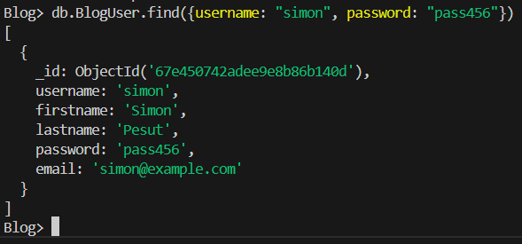

=== 2. Alle Blog-Einträge eines bestimmten Benutzers (nach Benutzername)
[source,js]
----
const user = db.BlogUser.findOne({ username: "givenUsername" });
db.BlogEntry.find({
  author_ids: {
    $in: db.BlogUser.distinct("_id", { username: "aaron" })
  }
});
----

image::Query_pics/AlleBlogsEinesBestimmtenAuthors.png[]

=== 3. Alle Blog-Einträge, bei denen ein bestimmtes Feld leer oder nicht vorhanden ist
[source,js]
----
db.blogs.find({ $or: [{ description: "" }, { description: { $exists: false } }] });
----
Ps: Description ist nicht leer

image::Query_pics/BlogsMitLeeremOderNichtVorhandenemEintrag.png[]

=== 4. Alle Blog-Einträge mit mehr als einem Bild
[source,js]
----
db.BlogEntry.find({ $expr: { $gt: [{ $size: "$content_images" }, 1] } });
----

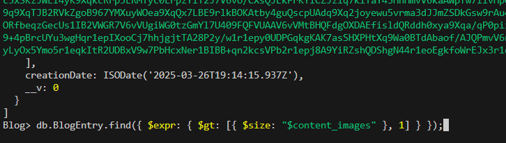

=== 5. Alle Blog-Einträge, die Bilder enthalten
[source,js]
----
db.BlogEntry.find({ content_images: { $exists: true, $ne: [] } });
----

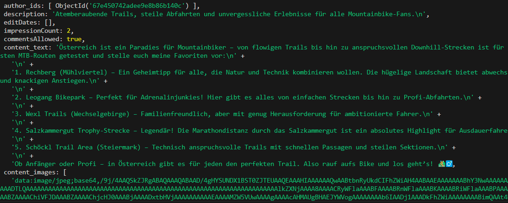

=== 6. Alle Blog-Einträge, deren Autor entweder einen bestimmten Nachnamen hat oder „admin“, aber nicht „Guest“
[source,js]
----
db.BlogEntry.find({
  author_ids: {
    $in: db.BlogUser.distinct("_id", {
      $or: [{ lastname: "Mistelberger" }, { username: "admin" }],
      username: { $ne: "Guest" }
    })
  }
});
----

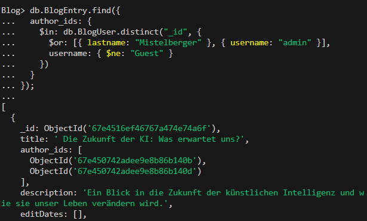

=== 7. Alle Blog-Einträge, bei denen der Titel auch im Inhalt vorkommt
[source,js]
----
db.BlogEntry.find({ $expr: { $regexMatch: { input: "$content", regex: "$title", options: "i" } } });

----
Ps: Kommt niergends im Inhalt vor

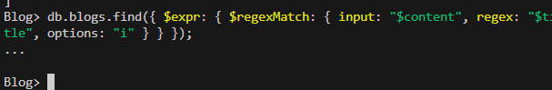

=== 8. Alle Blog-User sortiert nach Benutzername (aufsteigend)
[source,js]
----
db.users.find().sort({ username: 1 });
----

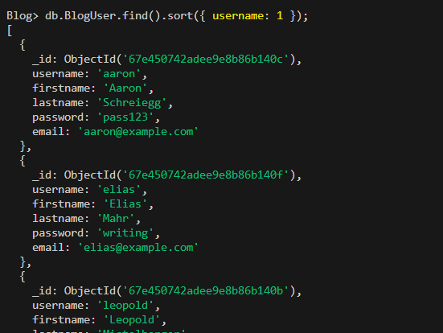

=== 9. Die zwei neuesten Blog-Einträge (sortiert nach `creationDate`)
[source,js]
----
db.blogs.find().sort({ creationDate: -1 }).limit(2);
----

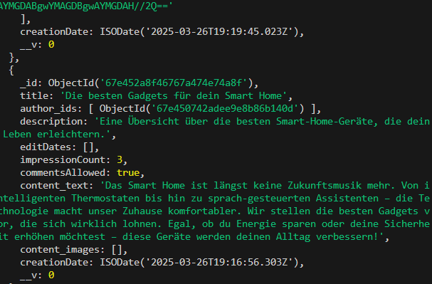

=== 10. Den zweitältesten Blog-Eintrag
[source,js]
----
db.blogs.find().sort({ creationDate: 1 }).skip(1).limit(1);
----

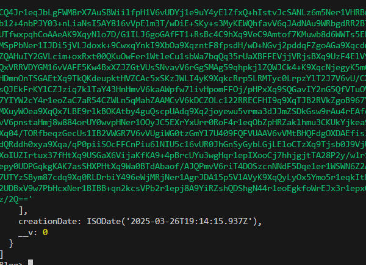

=== 11. Alle Blog-Einträge, die in der letzten Woche erstellt wurden und einen Link enthalten
[source,js]
----
db.blogs.find({
  creationDate: { $gte: new Date(new Date().setDate(new Date().getDate() - 7)) },
  content: { $regex: "https?://", $options: "i" }
});
----

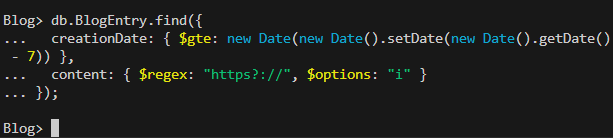

=== 12. Die zwei neuesten Kommentare zu den Einträgen eines bestimmten Benutzers
[source,js]
----
db.comments.find({ "blogAuthor": "timon" }).sort({ creationDate: -1 }).limit(2);
----

Ps: Keine Kommentare bei dem Author Timon

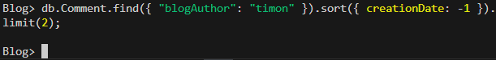

== Index&Changes

=== 1. Add a existing Author to a BlogEntry
[source,js]
----
db.BlogEntry.updateOne(
  { _id: ObjectId("67e1ba9e781ed6570251e94c") },
  { $addToSet: { author_ids: ObjectId("67e1ba9e781ed6570251e947") } }
);
----

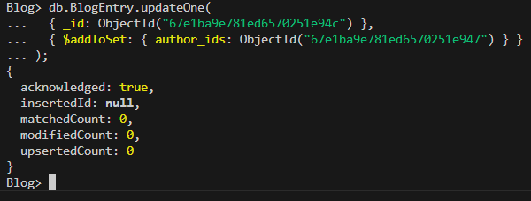

=== 2. Add a aditional Field to a BlogEntry
[source,js]
----
db.BlogEntry.updateOne(
  {},
  { $set: { hashtag: "#mongodb" } },
  { sort: { creationDate: -1 } }
);
----

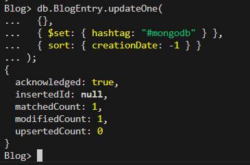  

=== 3. Change name of BlogCategory
[source,js]
----
db.BlogCategory.updateOne(
  { name: "Food" },
  { $set: { name: "Food & Drinks" } }
);
----

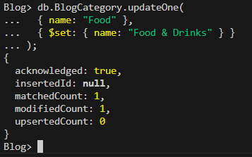

=== 4. Add a new BlogEntry if not exists otherwise edit
[source,js]
----
db.BlogEntry.updateOne(
  {
    title: "MongoDB Basics",
    author_ids: [
      ObjectId("67e1ba9e781ed6570251e944"), // Beispiel-Autor 1
      ObjectId("67e1ba9e781ed6570251e945")  // Beispiel-Autor 2
    ]
  },
  {
    $set: {
      description: "An introduction to MongoDB.",
      creationDate: new Date("2025-02-14"),
      editDates: [
        new Date("2025-02-15"),
        new Date("2025-02-16"),
        new Date("2025-02-17"),
        new Date("2025-02-18")
      ],
      impressionCount: 22,
      commentsAllowed: true,
      content_text: "MongoDB is a NoSQL database...\nEdit 1\nEdit 2",
      content_images: []
    }
  },
  { upsert: true }
);
----

image::./../IndexAndChanges/pics/newBlogEntryIfNotExists.png[]

=== 5. Delete BlogEntry and its Comments
[source,js]
----
db.BlogEntry.deleteOne({ _id: ObjectId("67e1ba9e781ed6570251e94c") });
db.Comment.deleteMany({ blog_entry_id: ObjectId("67e1ba9e781ed6570251e94c") });
----

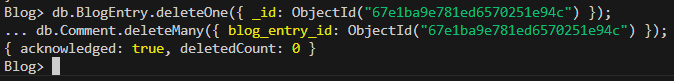

=== 1. Only unique Usernames
[source,js]
----
db.BlogUser.createIndex({ username: 1 }, { unique: true });
----

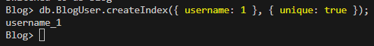

=== 2. Only unique BlogEntry-Titles and Usernames combined on blogEntry
[source,js]
----
db.BlogEntry.createIndex({ title: 1, author_ids: 1 }, { unique: true });
----

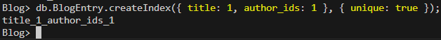

== Gitub-Repository

link:https://github.com/aaronschreiegg/mongodb-blog[mongodb-blog]
