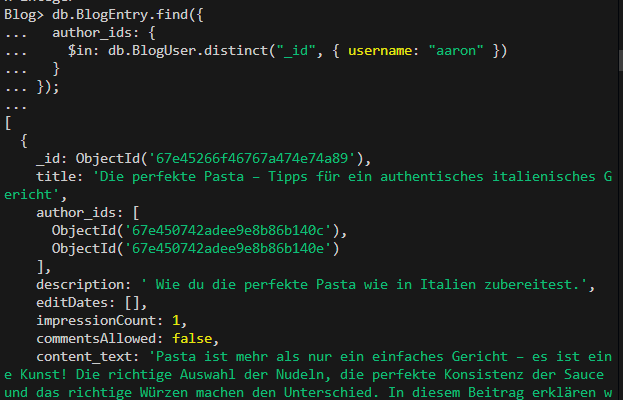
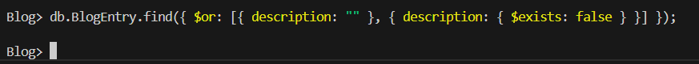

= MongoDB Queries für Blog-System

=== 1. Alle Blog-User, bei denen der Benutzername und das Passwort übereinstimmen
[source,js]
----
db.users.find({ username: "simon", password: "pass456" });
----

=== 2. Alle Blog-Einträge eines bestimmten Benutzers (nach Benutzername)
[source,js]
----
const user = db.BlogUser.findOne({ username: "givenUsername" });
db.BlogEntry.find({
  author_ids: {
    $in: db.BlogUser.distinct("_id", { username: "aaron" })
  }
});
----

=== 3. Alle Blog-Einträge, bei denen ein bestimmtes Feld leer oder nicht vorhanden ist
[source,js]
----
db.blogs.find({ $or: [{ description: "" }, { description: { $exists: false } }] });
----
Ps: Description ist nicht leer

=== 4. Alle Blog-Einträge mit mehr als einem Bild
[source,js]
----
db.BlogEntry.find({ $expr: { $gt: [{ $size: "$content_images" }, 1] } });
----

=== 5. Alle Blog-Einträge, die Bilder enthalten
[source,js]
----
db.BlogEntry.find({ content_images: { $exists: true, $ne: [] } });
----

=== 6. Alle Blog-Einträge, deren Autor entweder einen bestimmten Nachnamen hat oder „admin“, aber nicht „Guest“
[source,js]
----
db.BlogEntry.find({
  author_ids: {
    $in: db.BlogUser.distinct("_id", {
      $or: [{ lastname: "Mistelberger" }, { username: "admin" }],
      username: { $ne: "Guest" }
    })
  }
});
----

=== 7. Alle Blog-Einträge, bei denen der Titel auch im Inhalt vorkommt
[source,js]
----
db.BlogEntry.find({ $expr: { $regexMatch: { input: "$content", regex: "$title", options: "i" } } });

----
Ps: Kommt niergends im Inhalt vor

=== 8. Alle Blog-User sortiert nach Benutzername (aufsteigend)
[source,js]
----
db.users.find().sort({ username: 1 });
----

=== 9. Die zwei neuesten Blog-Einträge (sortiert nach `creationDate`)
[source,js]
----
db.blogs.find().sort({ creationDate: -1 }).limit(2);
----

=== 10. Den zweitältesten Blog-Eintrag
[source,js]
----
db.blogs.find().sort({ creationDate: 1 }).skip(1).limit(1);
----

image::Query_pics/DenZweitÄltestenBlogEintrag.png[]

=== 11. Alle Blog-Einträge, die in der letzten Woche erstellt wurden und einen Link enthalten
[source,js]
----
db.blogs.find({
  creationDate: { $gte: new Date(new Date().setDate(new Date().getDate() - 7)) },
  content: { $regex: "https?://", $options: "i" }
});
----

=== 12. Die zwei neuesten Kommentare zu den Einträgen eines bestimmten Benutzers
[source,js]
----
db.comments.find({ "blogAuthor": "timon" }).sort({ creationDate: -1 }).limit(2);
----

Ps: Keine Kommentare bei dem Author Timon

